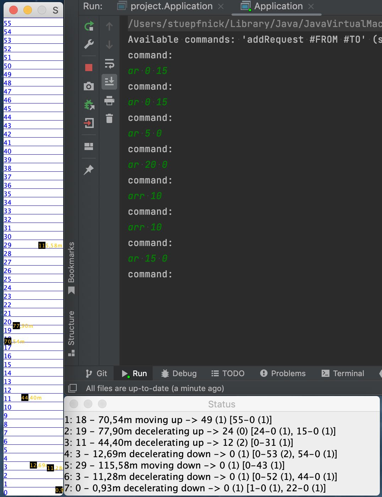

**Project: elevators**  
*IBM Coding challenge: ICON Tower Vienna*

It has a floor 0 (ground floor) plus 55 floors and now also calculates passanger capacity in a quite simple way. Already have ideas for more efficiency, maybe I will add them later, as the project is very interesting. Maybe also more testing.

Written 100% in Java and it uses Swing GUI for the display of the simulation.

Simply clone the repo, run it and enter the commands in the console (it will show possible commands after start), see resultes in Swing windows.

**Screenshot:** 

Status Windows shows in each row:  
#Elevator: #Floor - height in meters, currentStatus, direction -> #DestinationFloor (#Passengers) [#RequestFromFloor-#RequestToFloor (#Passengers), …]

**#** stands for "Number of "
