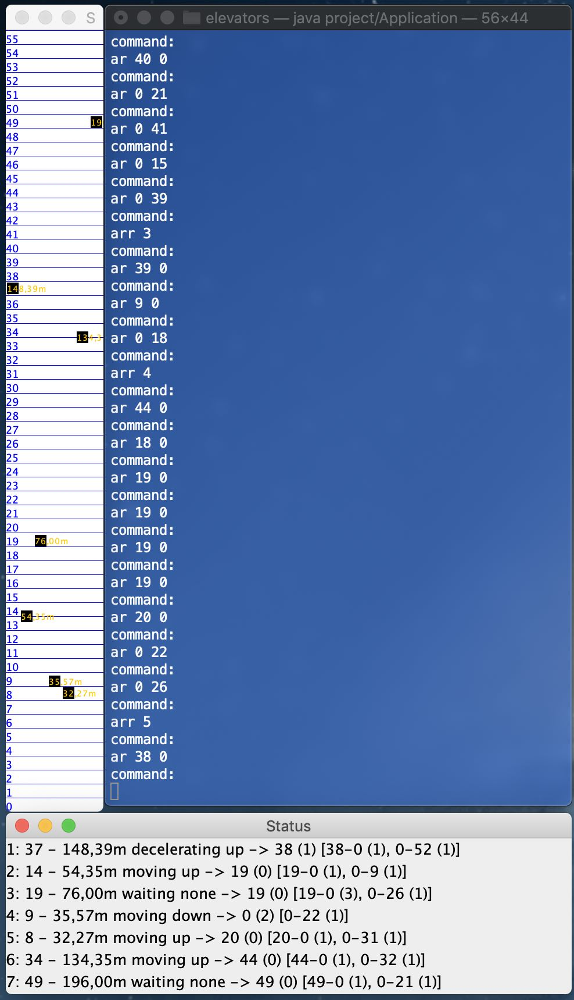

**Project: elevators**  
*IBM Coding challenge: ICON Tower Vienna*

It has a floor 0 (ground floor) plus 55 floors and now also calculates passanger capacity in a quite simple way. Already have ideas for more efficiency, maybe I will add them later, as the project is very interesting. Maybe also more testing.

Written 100% in Java and uses Swing GUI for the display of the simulation.

Simply clone the repo*, run it and enter the commands in the console (it will show possible commands after start), see results in Swing windows. 

**for ElevatorTest you need to add JUnit (5) library to the project, if you just want run the application, you can also delete "ElevatorTest.java" after cloning*
  
**Screenshot:** 

Status Windows shows in each row:  
#Elevator: #Floor - height in meters, currentStatus, direction -> #DestinationFloor (#Passengers) [#RequestFromFloor-#RequestToFloor (#Passengers), …]

**#** stands for "Number of "
